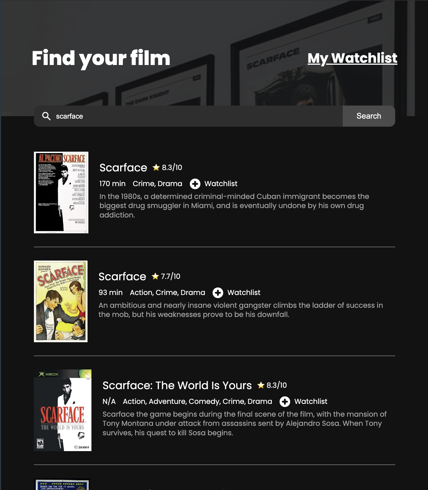

# Mywatchlist

A responsive web application that allows users to search for movies and create their personal watchlist using the OMDB API.

## Features

- Search movies using OMDB API
- Add/remove from watchlist
- Mobile-first responsive design (320px to 1440px)
- Persistent storage using localStorage
- Loading states and error handling
- Expandable movie descriptions

## Technologies Used

- Vanilla JavaScript
- CSS3 with Media Queries
- HTML5
- OMDB API
- LocalStorage for data managing

## Project Structure

```
movie-watchlist/
│
├── index.html          # Main search page
├── watchlist.html      # Watchlist view
├── style.css          # Styles and responsive design
├── index.js           # Main functionality
├── watchlist.js       # Watchlist functionality
└── images/           # Project images
```

## Demo

[Live Demo](https://mywatchlistt.netlify.app/) 

 

## Usage

1. Search for movies using the search bar
2. Save movies to watchlist
3. Navigate to Watchlist to view saved movies
4. Click "Remove" to delete movies from watchlist

## Responsive Design

- Mobile: 320px+
- Tablet: 420px+
- Desktop: 768px+
- Large Desktop: 1440px+


